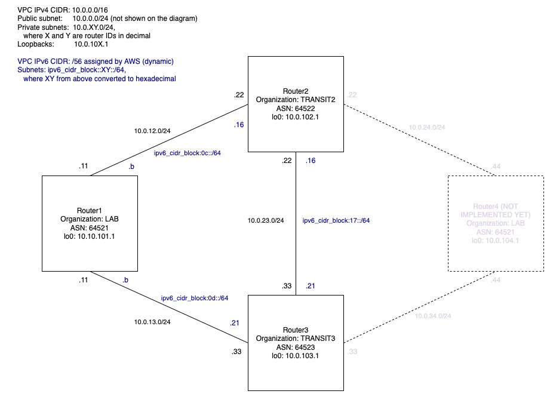

# bird_sandbox
Source code for a virtualised [BIRD](https://bird.network.cz/) lab hosted on AWS, automated with Terraform and Ansible

## How-to
Git clone locally

### Work in Visual Studio Code -> Devcontainer

Open the cloned folder in VScode.

When prompted by vscode, reopen in devcontainer. If you are new to devcontainers, read [here](https://code.visualstudio.com/docs/remote/containers).

Work from the vscode embedded terminal(s). It is not mandatory, but just easier: 

- requirements are already installed in the devcontainer
- their versions are compatible with the automation

Provision the infrastructure with Terraform. 

Configure the infrastructure with Ansible.

For the details, check the READMEs in related folders.

#### SSH
To share your credentials with the container, read [here](https://code.visualstudio.com/docs/remote/containers#_sharing-git-credentials-with-your-container).

### Work without Visual Studio Code

Same as in the devcontainer, but you need to install the tools and dependencies yourself. 

Please mind compatibility of the automation and the versions of your local tools / dependencies. 
